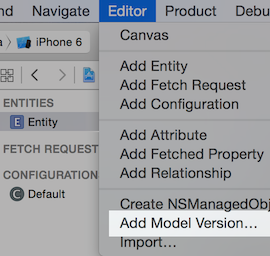
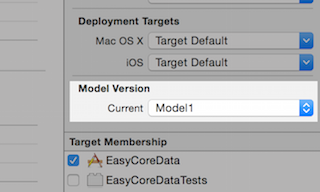

# Easy Core Data

#### 主要功能

* 线程安全
* 数据迁移

### 线程安全

***You must create the managed context on the thread on which it will be used. If you use NSOperation, note that its init method is invoked on the same thread as the caller. You must not, therefore, create a managed object context for the queue in the queue’s init method, otherwise it is associated with the caller’s thread. Instead, you should create the context in main (for a serial queue) or start (for a concurrent queue).***(摘自苹果文档)

总的来说，为了进行数据同步，将 MOC 分为三层：后台存储管理、主线程与界面交互、其它线程数据处理。一个 Model 对应一个后台 MOC（bMOC） 和一个主线程 MOC（mMOC），非主线程对应唯一一个 MOC（pMOC），其父子关系为 pMOC.parent = mMOC, mMOC.parent = bMOC，如下图


bMOC 为自动初始化，且不可直接使用，所有的操作只能在 mMOC/pMOC 中进行，pMOC 会跟据情况自动保存数据，也可以直接调用 `EasyCoreData.save()` 方法对数据进行保存。

### 数据迁移

Warning: ***只处理了轻量迁移(Light weight migrate)的情况***

轻量迁移需要完成三个步骤：

1. 添加 Model version：

2. 设置 Model Version：
3. 在新的 Model 中对 Entity 进行简单的修改

### 使用说明

* 获取 MOC 及插入实例 Entity：

```
var moc = EasyCoreData.context(momd: "Model")
var mob = moc.insert(entity: Entity.self)

...

moc.save(nil)
```

* 查找（获取）Entity 实例

```
...

var mobs: [Entity] = moc.objects(entity: Entity.self)
```

不可以在不同的线程中传递 moc 和 mo 。不同的线程中可通过 `EasyCoreData.context(momd: "Model")` 获取 moc ，moc 没有被 retain，超出语法范围后，将被释放（与局部变量生命同期相同），可通过 `moc.cache()` 将 moc 与所在线程关联，即使超出语法范围，在线程（NSThread 实例) 关闭（释放）前，moc 不会被释放；调用 `moc.deCache()` 方法解除关联。 mo 的传递需通过传递 mo.objectID 实现，传递前需要先调用 moc.save() 方法。

###### Notice

代码中添加了 `func EMOC(momd: String) -> NSManagedObjectContext`  快捷方法，如果不需要或与其它代码冲突，可以删除